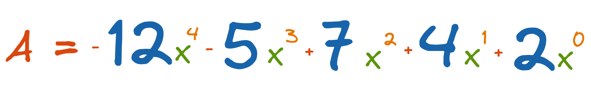
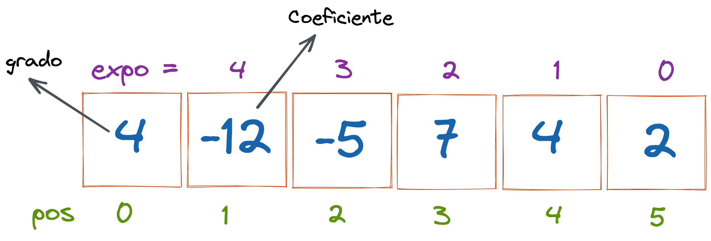
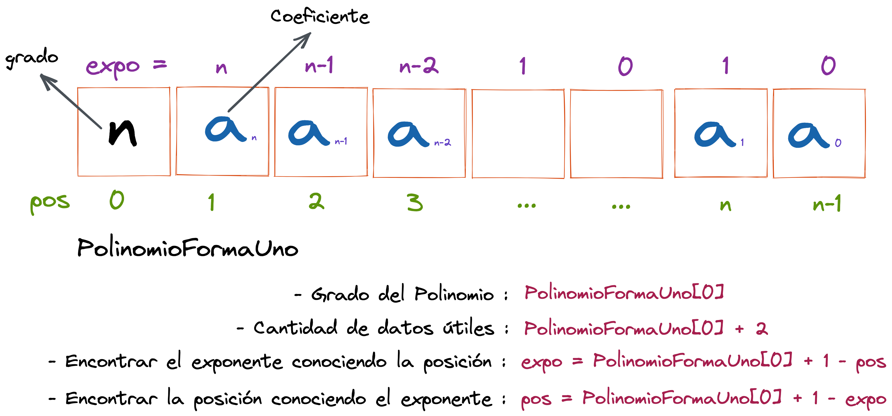

# Polinomios representados como Listas (Vectores)

El primer elemento del vector será **el grado del polinomio** y los siguientes `n+1` elementos serán los coeficientes de los términos del polinomio ordenados en forma **decreciente de acuerdo al exponente.**

Si tenemos el siguiente polinomio de **grado 4**.

La siguiente figura muestra la representación del polinomio en un vector forma 1.

En su forma general, un polinomio representado como vector forma 1 quedaría definido de la siguiente manera:

